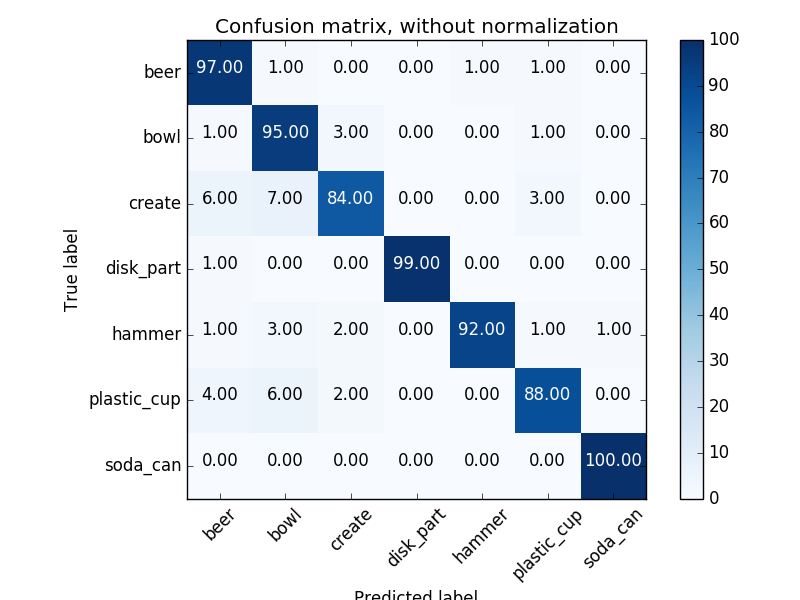

## Project: Perception Pick & Place

---

#### 1. Provide a Writeup / README that includes all the rubric points and how you addressed each one.  You can submit your writeup as markdown or pdf.  

### Exercise 1, 2 and 3 pipeline implemented
#### 1. Complete Exercise 1 steps. Pipeline for filtering and RANSAC plane fitting implemented.
This is image seen from the camera before any pipleine is implemented.

After filtering and RANSAC plane fitting, the table and objects are separated. They are shown in below images, respectively.

#### 2. Complete Exercise 2 steps: Pipeline including clustering for segmentation implemented.  
The objects are separated by using DBSCAN algorithm.

#### 3. Complete Exercise 3 Steps.  Features extracted and SVM trained.  Object recognition implemented.
For identifying these objects, we first generate a SVM classifier and train it based on features we extracted. The performance of SVM classifier is shown as confusion matrix.

Using this classifier, we can identify the three objects succesfully.

### Pick and Place Setup

#### 1. For all three tabletop setups (`test*.world`), perform object recognition, then read in respective pick list (`pick_list_*.yaml`). Next construct the messages that would comprise a valid `PickPlace` request output them to `.yaml` format.

The object recognition for all three tabletop setups are finished. The below images are screenshots for the three setups. 

I take a few steps to peform the object recognition. I used the statistical outlier filter to remove noise from the original point cloud data, downsample the data to reduce the size, and applied the pass through filter to select the region of interest.  The target region then contains objects and the tabletop. 

Next the RANSAC plane fitting algorithm is used to extract the point cloud data correspond to the tabletop. The remaining data are objects on the table we want to identify. The DBSCAN algorithm is then used to peform the clustering, then objects are separated individually. Before the final recoginition step, we train a SVM classifier on the features extracted from some objects. We use this classifier to predict each segemented object.

This pipeline works well in most cases. One problem is the recognition result is unstable for the same scene. The possible reason is the noise filter is not so good, and I need design it more carefully. The other problem is some object seems difficult to identify correctly. I may need to carefully to train a classifier or find suitable features to train.